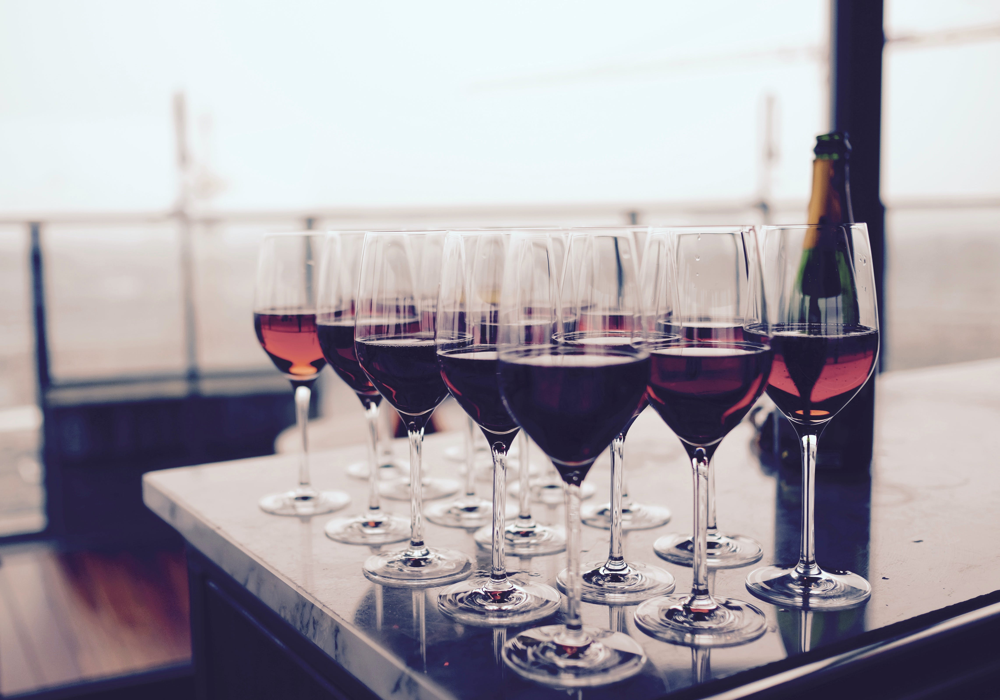
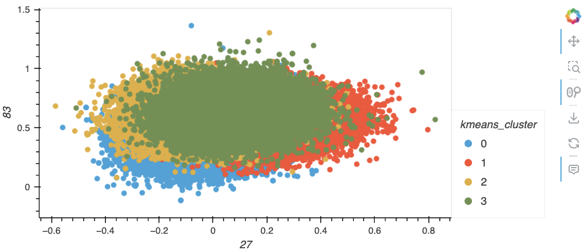
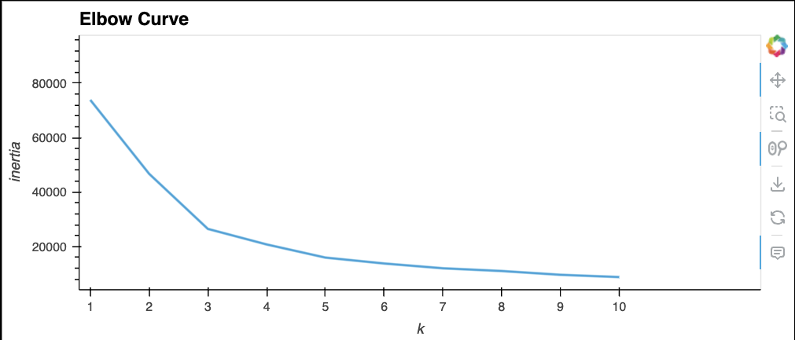
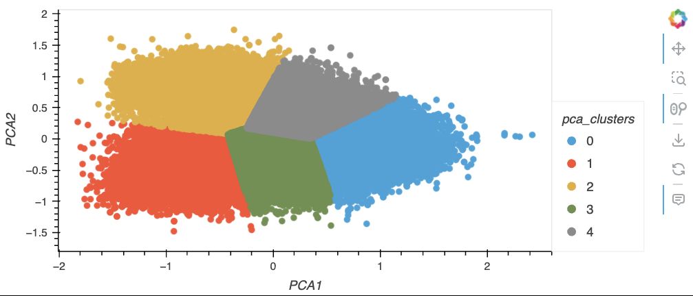
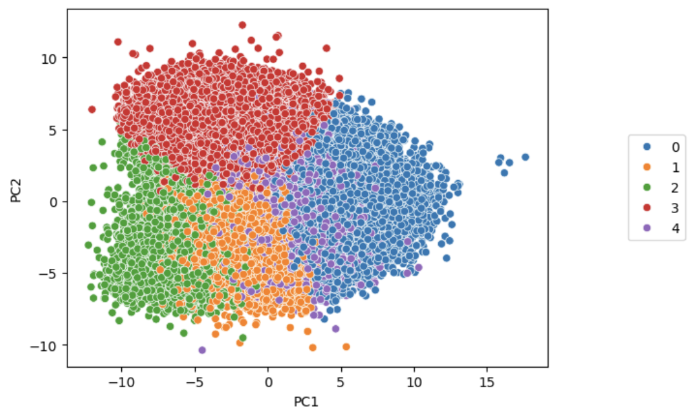
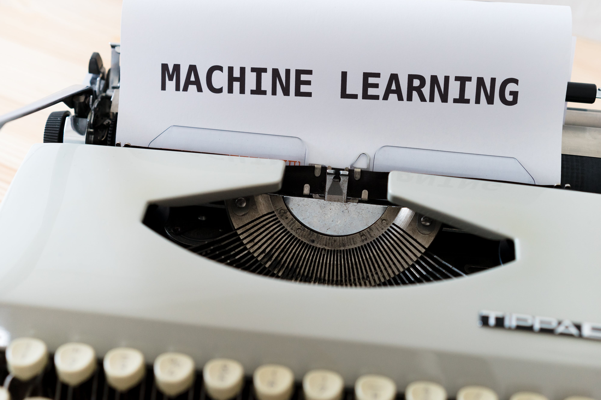

# SpiceUpYourLife - A Machine Learning Exploration of Wine 

This wine recommendation model was created as a final project for the University of Pennsylvania Data Analysis & Visualization Bootcamp. We were challenged to solve, analyze, or visualize a problem using machine learning (ML) 

## Description

The goal of this project is to use Machine Learning to find your preferred wine variety based on your palate descriptors. The original Kaggle dataset contained wines of various varieties, made in different countries, which were then described by several critics. Using this dataset, the sample size was narrowed down to wines produced in the top 12 countries, all of which had >1,000 wines reviewed. To predict which wines would best fit a user's taste profile, several machine learning models were applied to the dataset, such as Word2Vec, TSNE, PCA and KMeans. Using the resulting clusters, a taste description input can be manipulated, the model can determine which cluster the description would fall into, and return a list of wine varieties with similar profiles the user should try. The user interface portion of the project is a website, created using flask, html, and css, which allows a user to input a taste description and return a list of wine varieties.

In addition to the Kaggle dataset, the Wine Folly article, "40 Wine Descriptions and What They Really Mean", was scrapped to create a json file containing common wine descriptions for reference in the project. The data scrapping script and resulting json file can be found in the Wine Folly folder. 

## Requirements

### Dependencies

This script was tested using a development environment containing Python 3.11. In addition, the following dependencies are required to run various aspects of the project: pandas, numpy, pathlib, gensim, nltk, sklearn, hvplot, seaborn, and matplotlib.

The project can also be run on Google Colab if dependencies are missing from a dev environment.

### Installation

Clone repo: git clone https://github.com/desireetrevino/SpiceUpYourLife.git

## Overview of Analysis

### Cleaning the Data

The original dataset had ~130K data points. The information was paired down to the 12 countries which each produced >1000 of the wines described in hopes of eliminating some of the noise in the model visualizations. 

### Preprocess Data

In order to convert the descriptions to vectors using Word2Vec, the description column had to first be manipluated. The Natural Language Toolkit (NLTK) was used to drop stop words, lemmatize, and tokenize the descriptions of each wine. 

### Compile, Train, and Evaluate the Models

* Word2Vec was used to train the model, it could return a list of words with similar vector points with the highest accuracy returning 70-80%. The model was also tested to show the similarty between different words. The descriptions were then converted into vector representations.

* TSNE was used for dimensionality reduction

* K Means - An elbow curve was used to determine 4 clusters should be used. Then a plot was formed with the clusters. 

* PCA was used to reduce the dimensionality of the large data set. An elbow curve determined 5 clusters should be used, and they a plot was created with the clusters.

hvplot 

seaborn

### Results

A webpage was created to allow a user to input a wine description. Similar to the model, the input data will be manipulated to drop stop words, lemmatize, and tokenize the user input. It will then run through Word2Vec to be converted into vectors. The PCA model and K-Nearest Neighbors, a supervised learning classifier, are used to predict which cluster the mean vector will fall into, and a list of 5 wine varieties in that cluster will be returned to the user. 

### Summary

Overall, the machine learning model is functioning; however, there are steps needed to improve the accuracy and robustness of the model to give accurate suggestions. 

## Resources

* Data for this project was sourced from Kaggle:
    https://www.kaggle.com/datasets/mysarahmadbhat/wine-tasting

* The article "40 Wine Descriptions and What They Really Mean" by Wine Folly:
    https://winefolly.com/tips/40-wine-descriptions/

* Royalty free photographs were found at pexels.com

### Collaborators
GitHub Usernames: crystalleelucas, desireetrevino, eldiscala, jackieoc, katyphillips, mtguadamuzruth, mwiley608
